# VAD Transcriber システムアーキテクチャ概要

## 1. システム全体構成

### 1.1 高レベルアーキテクチャ

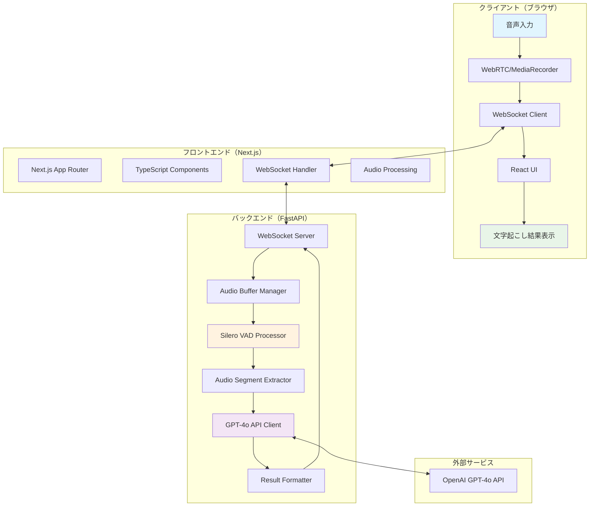

### 1.2 データフロー詳細

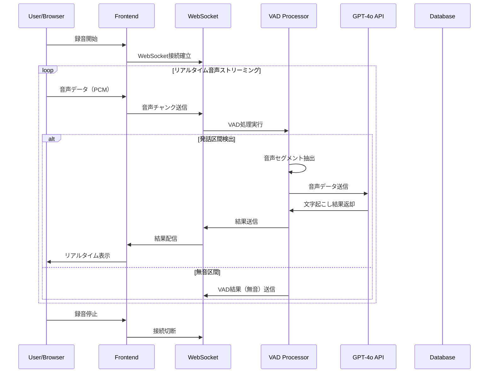

## 2. コンポーネント詳細

### 2.1 フロントエンド構成

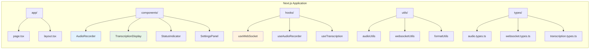

### 2.2 バックエンド構成

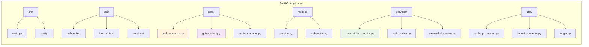

## 3. 技術スタック詳細

### 3.1 フロントエンド技術

| 技術 | バージョン | 用途 |
|------|------------|------|
| Next.js | 15.x | React フレームワーク |
| TypeScript | 5.x | 型安全性確保 |
| React | 18.x | UI コンポーネント |
| WebSocket API | Native | リアルタイム通信 |
| MediaRecorder API | Native | 音声録音 |
| Tailwind CSS | 3.x | スタイリング |
| Zustand | 4.x | 状態管理 |

### 3.2 バックエンド技術

| 技術 | バージョン | 用途 |
|------|------------|------|
| FastAPI | 0.110.x | Web フレームワーク |
| Python | 3.12 | 実行環境 |
| Silero VAD | latest | 音声アクティビティ検出 |
| PyTorch | 2.x | VAD モデル実行 |
| OpenAI API | 1.x | GPT-4o 音声認識 |
| uvicorn | 0.28.x | ASGI サーバー |

### 3.3 インフラ技術

| 技術 | バージョン | 用途 |
|------|------------|------|
| Docker | 24.x | コンテナ化 |
| Docker Compose | 3.8 | オーケストレーション |
| GitHub Actions | - | CI/CD |
| Nginx | 1.25 | リバースプロキシ |

## 4. 音声処理パイプライン

### 4.1 音声データ変換フロー

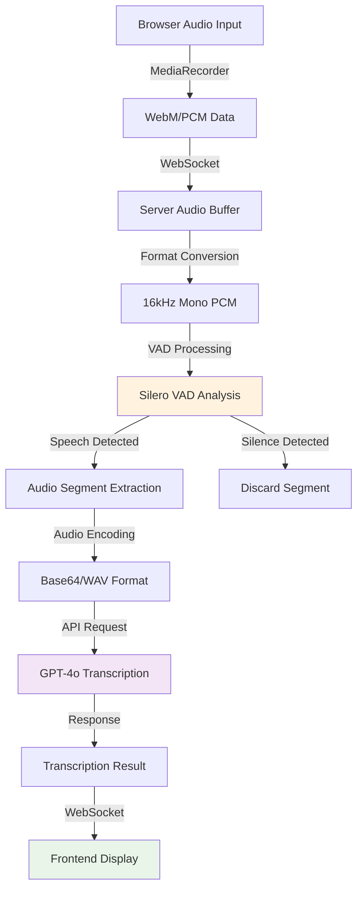

### 4.2 VAD処理詳細

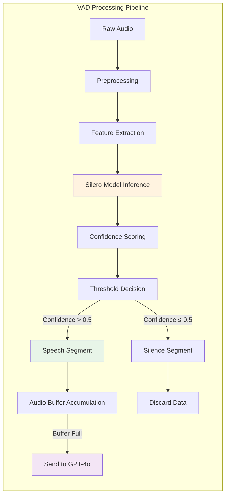

## 5. WebSocket通信仕様

### 5.1 接続管理

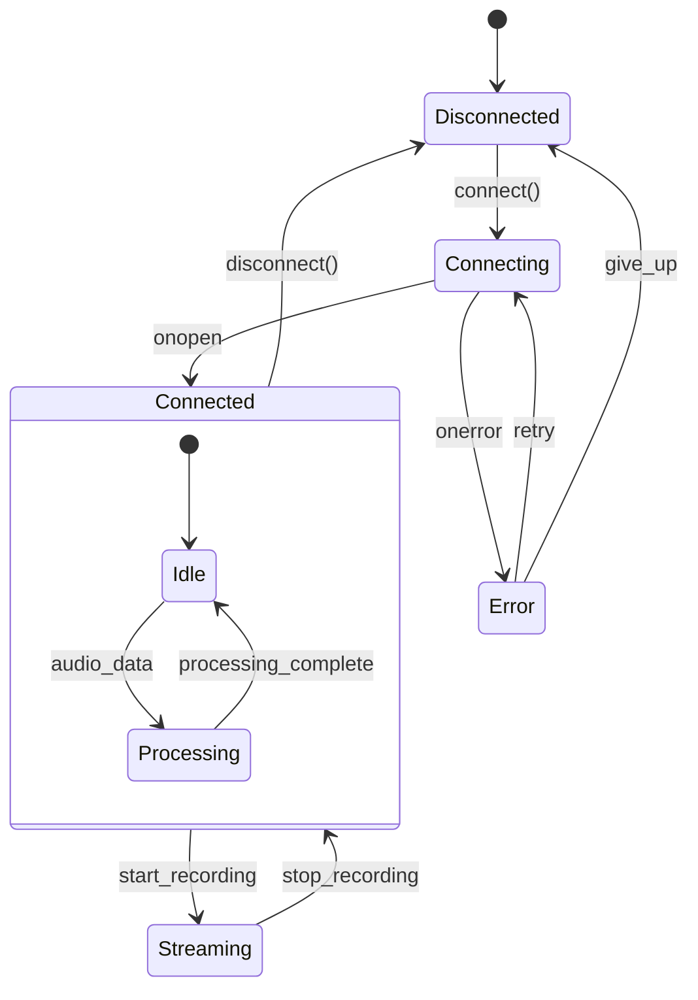

### 5.2 メッセージタイプ

| メッセージタイプ | 方向 | 説明 |
|------------------|------|------|
| `audio_data` | Client → Server | 音声データチャンク |
| `transcription_result` | Server → Client | 文字起こし結果 |
| `vad_result` | Server → Client | VAD処理結果 |
| `error` | Server → Client | エラー通知 |
| `status` | Server → Client | システム状態 |
| `config` | Client → Server | 設定変更 |

## 6. エラーハンドリング戦略

### 6.1 エラー分類

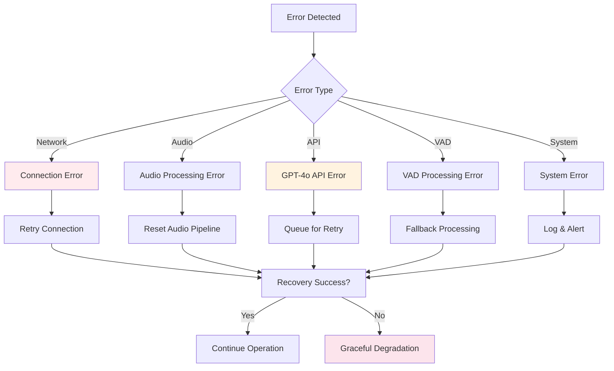

### 6.2 復旧メカニズム

| エラータイプ | 復旧手順 | タイムアウト |
|--------------|----------|--------------|
| WebSocket切断 | 自動再接続（指数バックオフ） | 30秒 |
| GPT-4o API エラー | リトライキューイング | 60秒 |
| VAD処理エラー | フォールバック処理 | 即座 |
| 音声入力エラー | デバイス再初期化 | 10秒 |
| システムエラー | ログ記録・アラート | - |

## 7. セキュリティ考慮事項

### 7.1 データ保護フロー

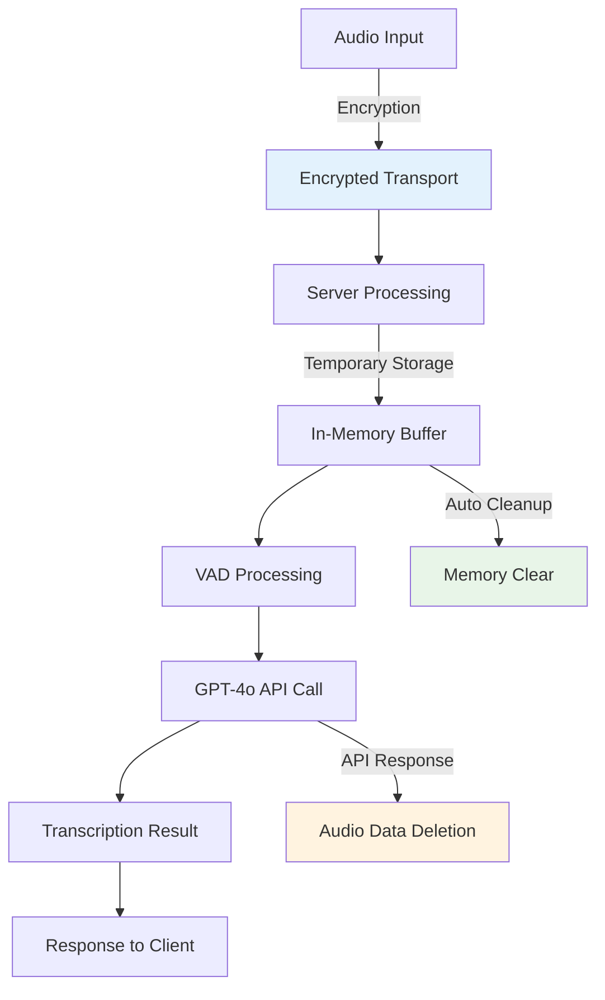

### 7.2 認証・認可

| レイヤー | 認証方式 | 認可レベル |
|----------|----------|------------|
| WebSocket | セッショントークン | ユーザーレベル |
| REST API | JWT トークン | ロールベース |
| GPT-4o API | API キー | サービスレベル |

## 8. 監視・ログ戦略

### 8.1 メトリクス収集

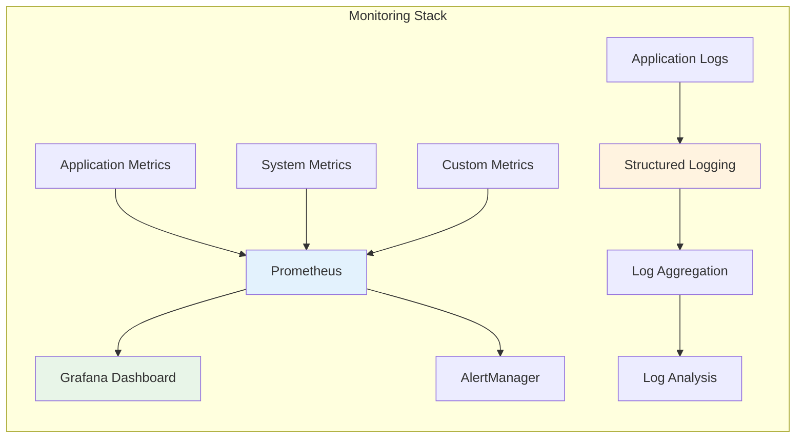

### 8.2 重要指標

| カテゴリ | 指標 | 閾値 |
|----------|------|------|
| パフォーマンス | WebSocket遅延 | < 50ms |
| パフォーマンス | VAD処理時間 | < 100ms |
| パフォーマンス | GPT-4o応答時間 | < 3s |
| 可用性 | システム稼働率 | > 99.5% |
| エラー | エラー率 | < 1% |
| リソース | メモリ使用率 | < 80% |
| リソース | CPU使用率 | < 70% |

## 9. デプロイメント戦略

### 9.1 コンテナ構成

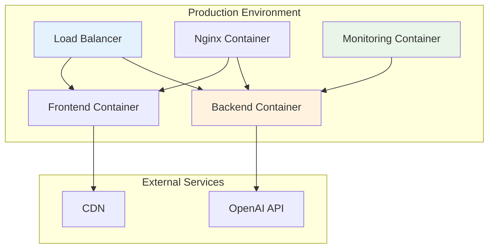

### 9.2 CI/CD パイプライン

| ステージ | 処理内容 | 条件 |
|----------|----------|------|
| Build | Docker イメージビルド | Push to main |
| Test | 単体・結合テスト実行 | 全ブランチ |
| Security | セキュリティスキャン | Pull Request |
| Deploy Staging | ステージング環境デプロイ | main ブランチ |
| Deploy Production | 本番環境デプロイ | タグプッシュ |

この包括的なアーキテクチャ概要により、開発チーム全体がシステムの全体像を理解し、効率的な開発を進めることができます。 