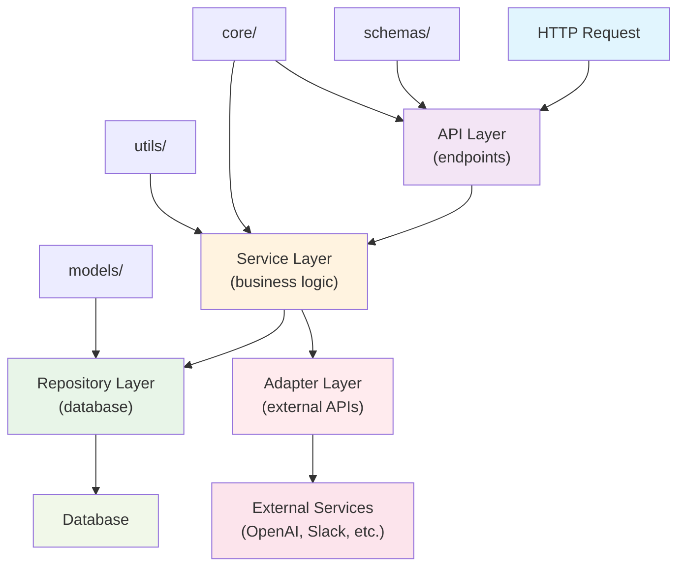
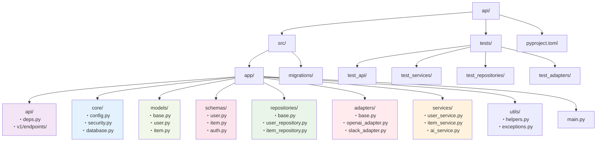
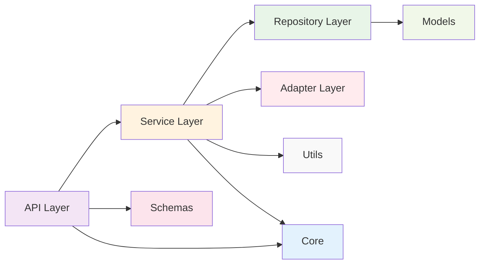

# FastAPI レイヤードアーキテクチャ 構成図

## アーキテクチャフロー図

## ディレクトリ構造図

## 依存関係の方向

## 各層の責任範囲

| 層 | 責任 | 依存先 | 注意点 |
|---|-----|-------|-------|
| **API Layer** | HTTPリクエスト処理 | Service Layer, Schemas, Core | ビジネスロジックを含まない |
| **Service Layer** | ビジネスロジック実装 | Repository Layer, Adapter Layer, Utils, Core | 複数のリポジトリ・アダプターを協調 |
| **Repository Layer** | データベースアクセス | Models, Core | 外部APIアクセスは含まない |
| **Adapter Layer** | 外部システム通信 | Core | データベースアクセスは含まない |
| **Core** | 設定・共通機能 | なし | 他の層から参照される基盤 |
| **Models** | データベーススキーマ | なし | SQLAlchemyモデル定義 |
| **Schemas** | API入出力定義 | なし | Pydanticモデル定義 |
| **Utils** | ユーティリティ | なし | 汎用ヘルパー関数 |

## 実装時のポイント

### 1. 依存性注入パターン
- FastAPIの`Depends()`を活用
- テスト時のモック化を容易にする
- 各層間の疎結合を保つ

### 2. 単一責任の原則
- 各ファイル・クラスは一つの責任のみ持つ
- 機能追加時も既存コードへの影響を最小化

### 3. インターフェース分離
- アダプターには抽象基底クラスを使用
- 実装の詳細を隠蔽し、テスタビリティを向上

### 4. 例外処理
- 各層で適切な例外処理を実装
- カスタム例外クラスでドメイン固有のエラーを表現 